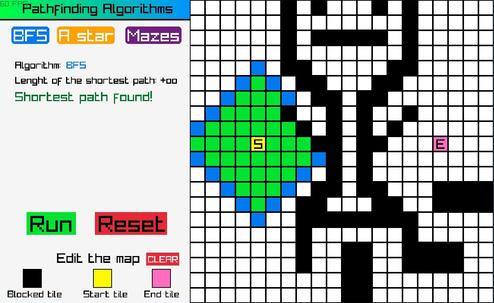
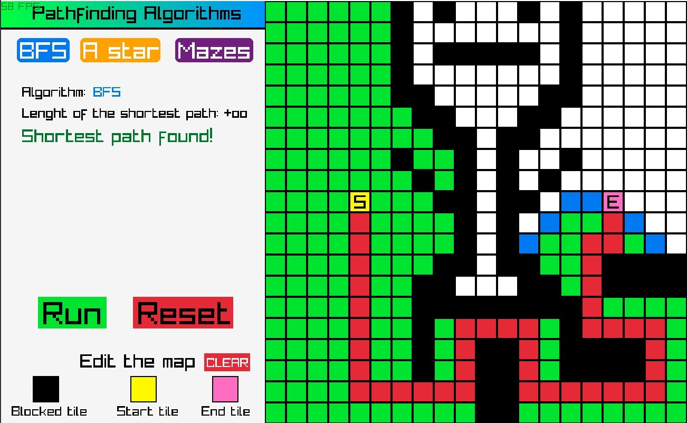
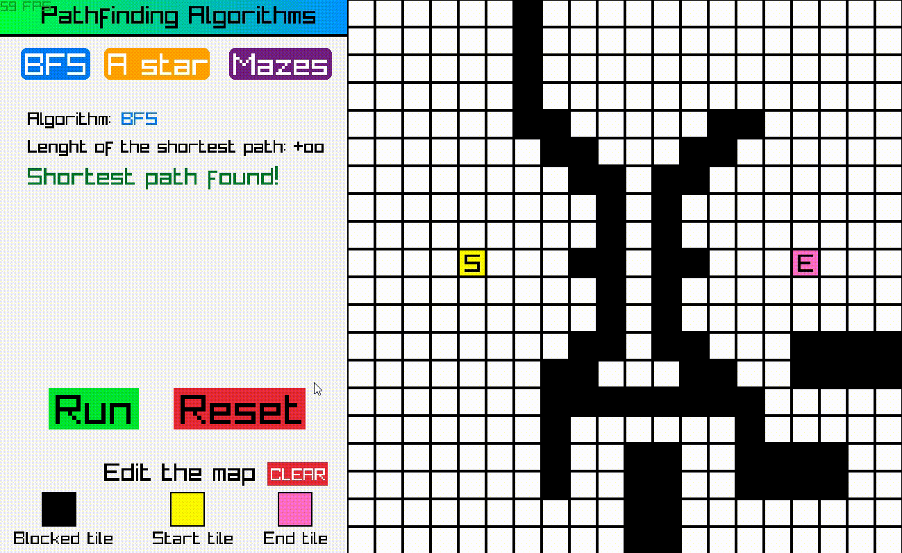

# paths
Visualization of pathfinding algorithms in C++. \
Gui and rendering - raylib.

## List of algorithms
- BFS
- A*
- Maze generation

## Screenshots
BFS after few steps:

BFS after finding the path:

Short gif:

## Instalation and usage
Copy this repository using `git clone https://github.com/M4c13j/paths.git` or download it manually. \
Now you have to install **raylib 4.0**. Go to this site if [Windows](https://github.com/raysan5/raylib/wiki/Working-on-Windows) or this if [Linux](https://github.com/raysan5/raylib/wiki/Working-on-GNU-Linux) and follow the instructions.

> Note that the code was made on 4.0 and in newer versions some features may be missing or not working properly.

Create folder `lib` in folder **paths** and copy file `libraylib.a` from installation there. \
In the folder **paths** you have file `main.cpp`. \
Compile it using **Makefile** on Windows or ~~curently to public repo not added Linux~~ \
File **main** or **main.exe** should be now in this folder. HF.
